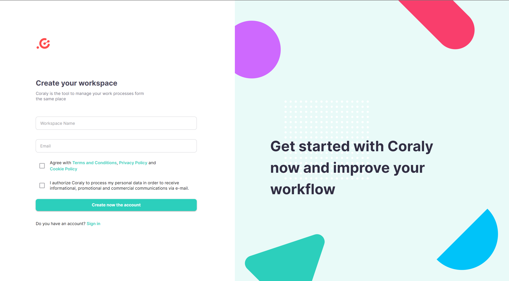
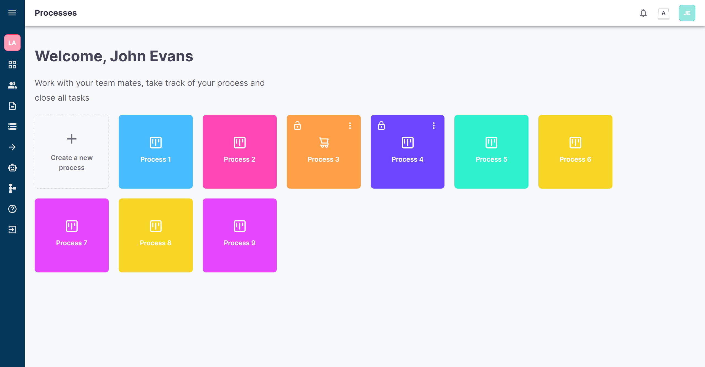
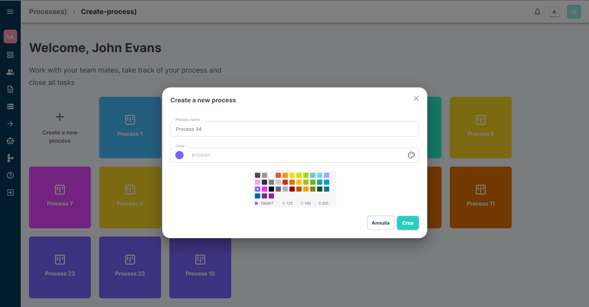
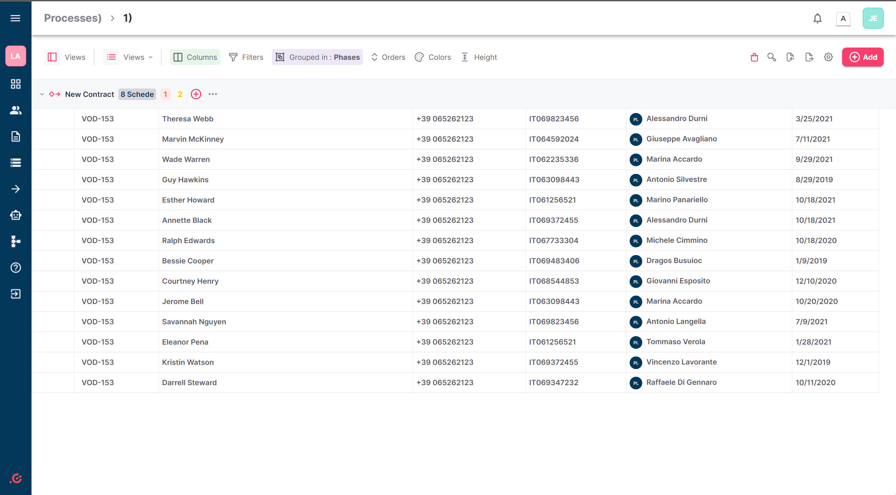
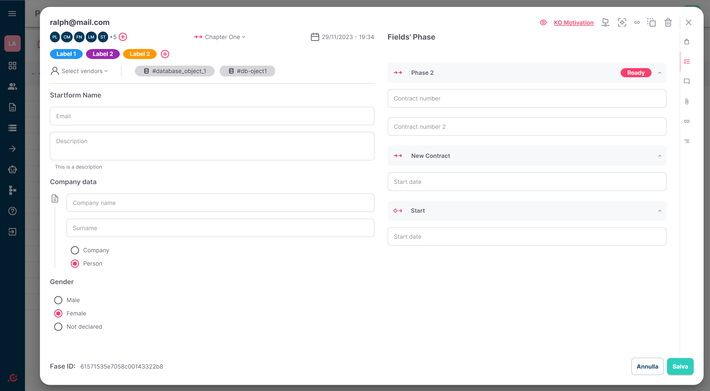
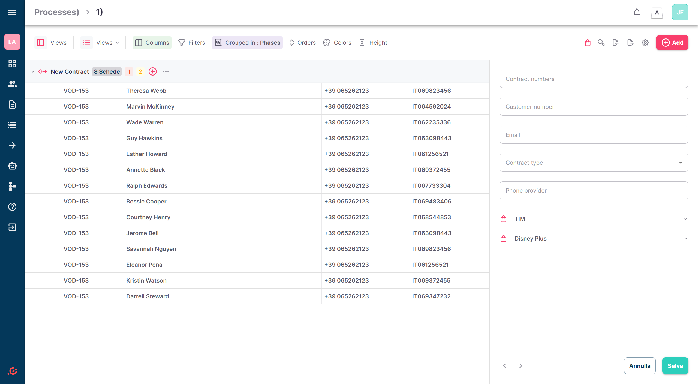

# Coraly Management App

Coraly Management App is a workspace and process management application designed to streamline work processes and enhance collaboration. The application features a user-friendly interface with a focus on frontend technologies like React and Material UI. The backend is powered by JSON Server to efficiently manage data.

### Table of Contents

- [Features](#features)
- [Installation](#installation)
- [Usage](#usage)
- [Screenshots](#screenshots)
- [Contributing](#contributing)
- [License](#license)

### Features

1. **User Authentication:**

- Login: Users can securely log in to their accounts.
- Sign Up: New users can create accounts and workspace with a simple registration process.
- Reset Password: Users can reset their passwords if forgotten.

2. **Workspace and Process Management:**

- Workspaces: Users can create and manage different workspaces.
- Processes: Each workspace can have multiple processes.
- User Assignment: Processes can be assigned to specific users for efficient task management.

3. **Frontend Technology:**

- Built with React: The frontend is developed using the React library for a dynamic and responsive user interface.
- Material UI: The application utilizes Material UI components for a sleek and consistent design.

4. **Backend Data Management:**

- JSON Server: The backend is implemented using JSON Server to handle data storage and retrieval.

### Installation

To install Coraly Management App, follow these steps:

1. Clone the repository to your local machine:

```bash
git clone https://github.com/yourusername/coraly-management-app.git`
```

2. Change into the project directory:

bash

```
cd coraly-management-app
```

3. Install dependencies using npm with the **--force** flag:

```bash
npm install --force
```

### Usage

1. Start the frontend on **`localhost:3000`**:

```bash
npm start
```

2. Run the JSON Server:

```bash
npm run server
```

3. Access the application by opening your web browser and navigating to **`http://localhost:3000`**.

### Screenshots















### Contributing

Contributions are welcome! Please fork the repository and create a pull request.

### License

This project is licensed under the [MIT License](https://opensource.org/license/mit/).
